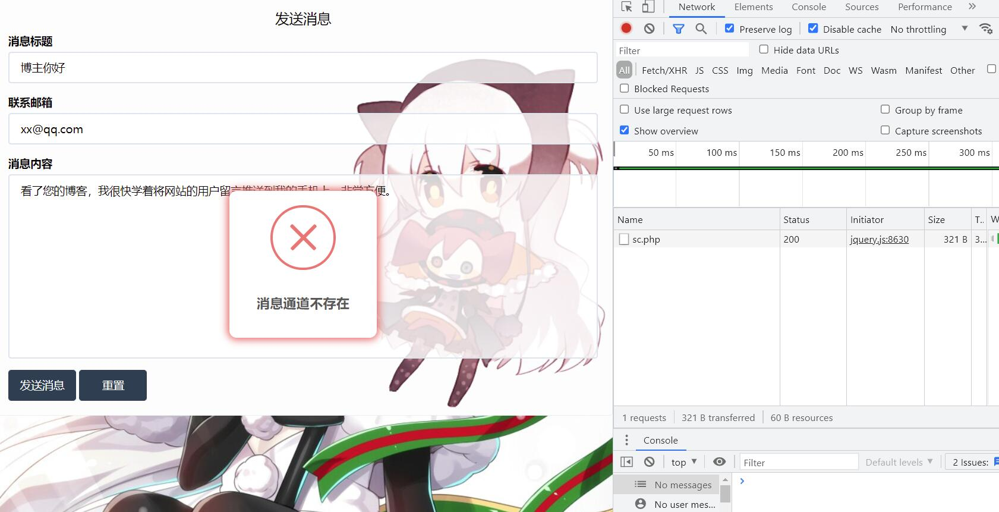
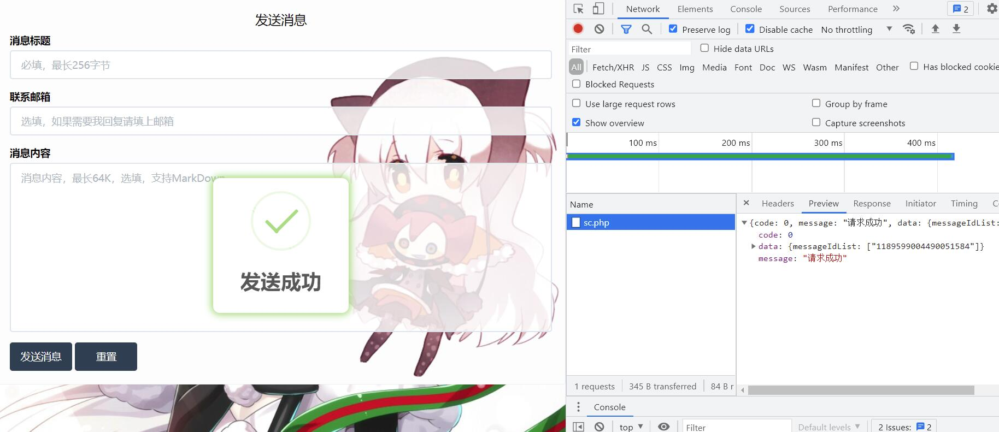
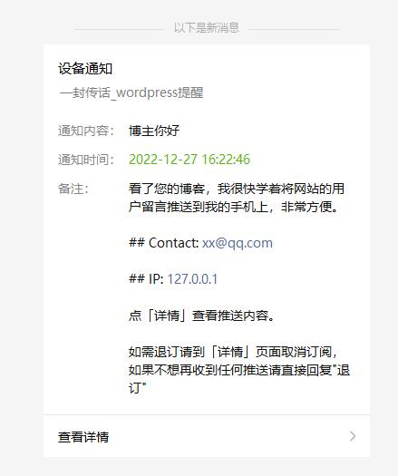
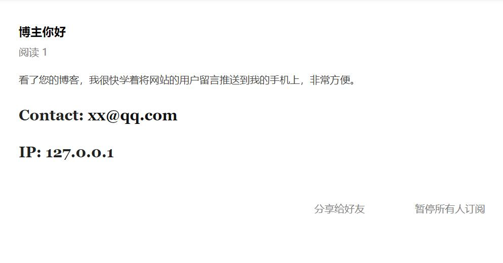

# liuyan-weixin
一个基于 [一封传话](https://www.phprm.com/push/h5/) 微信推送服务的私信发送器

可用于个人博客联系方式等私信发送需求场合，并且会将消息发送者的 IP 一并发送.

先去创建一个口令提醒, 复制口令, 例如: https://www.phprm.com/services/push/trigger/9354f99096989cac

部署完之后请修改`.key.php`，写上你的`9354f99096989cac`

填写内容，如果不在.key.php文件中填写正确的口令，大概率会提示这样的错误：



如果填写正确，发送成功后, 你会得到一条消息ID



去查看微信上推送记录, 你会看到消息标题和内容, 内容支持markdown语法:



点击「查看详情」跳转到markdown预览页面, 其中联系方式和IP地址都被加粗显示了：



在预览页面，还可以一键分享或者暂停推送。

如果需要修改背景图片之类的请编辑`index.php`修改 head 中的 css 内容

另外，访问时带上 get 参数`nobg`可以将背景图变成透明，方便在 iframe 中使用
```
https://xxx.com/?nobg
```
